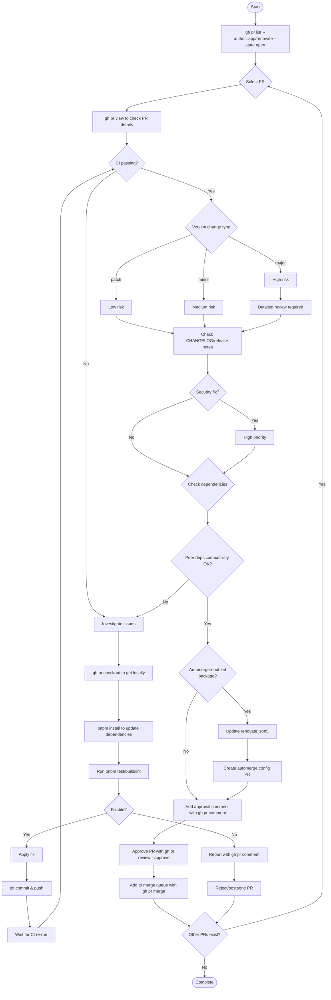

## Task
Review renovate PRs following this workflow:

### Review Criteria
- **Security updates**: Always HIGH priority
- **Patch updates**: LOW risk - quick review
- **Minor updates**: MEDIUM risk - check for new features
- **Major updates**: HIGH risk - detailed review required

### Arguments
$ARGUMENTS

